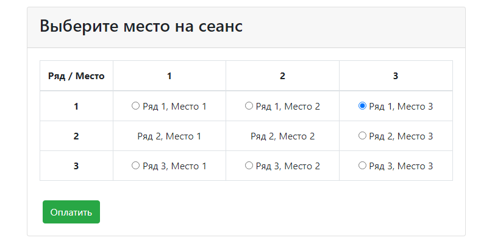
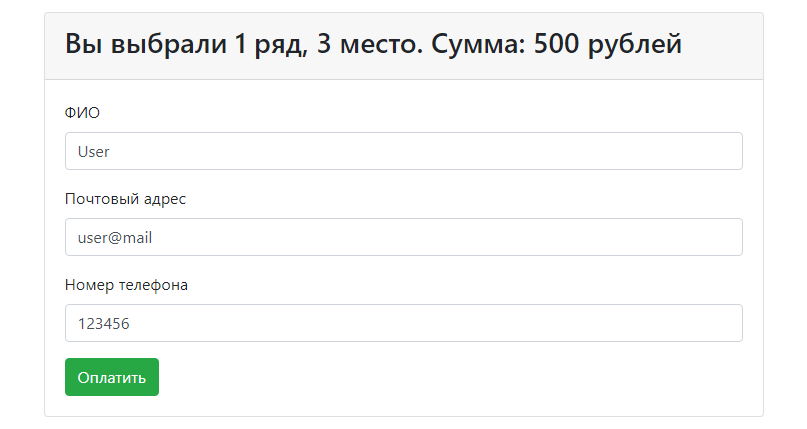

[](https://app.travis-ci.com/VadimShein/job4j_cinema)
# <p align="center">Сервис бронирования билетов</p>

## Описание:
Приложение реализует функционал покупки билетов в кинотеатр.
Пользователь выбирает подходящее место, а после заполняет форму и производит оплату. 
Регистрация посетителя производится автоматически по введенной почте. 
Доступные билеты обновляются периодически раз в 2 секунды.

## Используемые технологии:
* Java 13, Servlets, JavaScript
* PostgreSQL, JDBC
* HTML, Bootstrap, CSS, JSP
* Maven, Tomcat


## Скриншоты:
1. Главная страница. Список всех мест в зале. Свободные места доступны для выбора.



2. Страница оплаты билета.




## Запуск проекта:
1. Скопировать проект 
```
git clone https://github.com/VadimShein/job4j_cinema
```

2. Создать базу данных cinema и таблицы из файла src/main/resources/db/schema.sql

3. Выполнить сборку проекта 
```
mvn clean package -DskipTests
```

4. Запустить приложение, адрес по умолчанию  [http://localhost:8080/job4j_cinema/index.jsp](http://localhost:8080/job4j_cinema/index.jsp)
Получившийся после сборки проекта файл cinema-1.0.war скопировать в каталог webapps Tomcat сервера. 
Выполнить настройку на веб-сервере для доступа к проекту через вебраузер.

## Контакты:
[](https://t.me/SheinVadim)
[](mailto:shein.v94@mail.ru)
